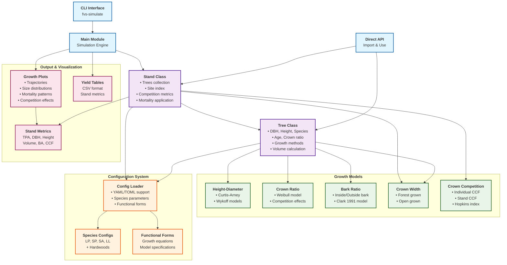

# FVS-Python Project Architecture

## Overview

FVS-Python is a **Southern Yellow Pine Growth Simulator** based on the Forest Vegetation Simulator (FVS) Southern variant. This document provides a comprehensive visual and textual overview of the project architecture.

## Project Architecture Diagram



## Component Details

### Entry Points (Blue)

#### CLI Interface (`cli.py`)
- **Command**: `fvs-simulate`
- **Functions**: Run simulations, convert configs, validate configurations
- **Usage**: `fvs-simulate run --years 50 --species LP --site-index 70`

#### Main Module (`main.py`)
- **Purpose**: Core simulation engine
- **Functions**: Stand initialization, growth simulation, yield table generation
- **Output**: CSV yield tables, visualization plots

#### Direct API
- **Usage**: Import classes and functions directly in Python code
- **Example**: `from fvs_python import Stand, Tree, create_height_diameter_model`

### Core Classes (Purple)

#### Stand Class (`stand.py`)
- **Manages**: Collection of trees, site conditions
- **Calculates**: Competition metrics, mortality rates, stand-level statistics
- **Methods**: `grow()`, `get_metrics()`, `initialize_planted()`

#### Tree Class (`tree.py`)
- **Attributes**: DBH, height, species, age, crown ratio
- **Methods**: `grow()`, `get_volume()`, height-diameter updates
- **Models**: Blends small-tree and large-tree growth approaches

### Growth Models (Green)

#### Height-Diameter (`height_diameter.py`)
- **Curtis-Arney**: `Height = 4.5 + P2 * exp(-P3 * DBH^P4)`
- **Wykoff**: `Height = 4.5 + exp(B1 + B2 / (DBH + 1))`
- **Features**: Numerical solver for reverse calculations

#### Crown Ratio (`crown_ratio.py`)
- **Model**: Weibull distribution-based
- **Factors**: Competition effects, tree size, stand density
- **Equation**: ACR model with species-specific parameters

#### Bark Ratio (`bark_ratio.py`)
- **Model**: Clark (1991) linear relationship
- **Equation**: `DIB = b1 + b2 * DOB`
- **Purpose**: Convert between inside and outside bark measurements

#### Crown Width (`crown_width.py`)
- **Forest Grown**: Equations for trees in forest conditions
- **Open Grown**: Equations for trees in open conditions
- **Usage**: Competition calculations, CCF computation

#### Crown Competition Factor (`crown_competition_factor.py`)
- **Individual CCF**: Per-tree competition index
- **Stand CCF**: Stand-level competition measure
- **Hopkins Index**: Alternative competition metric

### Configuration System (Orange)

#### Config Loader (`config_loader.py`)
- **Formats**: YAML and TOML support
- **Features**: Unified parameter loading, format conversion
- **Structure**: Species configs, functional forms, site index parameters

#### Species Configurations
- **Pine Species**: LP (Loblolly), SP (Shortleaf), SA (Slash), LL (Longleaf)
- **Hardwoods**: Hickory, elm, cherry, dogwood, tulip tree, etc.
- **Parameters**: Growth coefficients, density limits, volume equations

#### Functional Forms
- **Growth Equations**: Mathematical model specifications
- **Model Types**: Chapman-Richards, ln(DDS), Curtis-Arney, Wykoff
- **Documentation**: Equation sources, variable definitions

### Output & Visualization (Pink)

#### Growth Plots (`growth_plots.py`)
- **Trajectories**: Stand development over time
- **Size Distributions**: DBH and height distributions
- **Mortality Patterns**: Mortality rates by age/size
- **Competition Effects**: CCF and density relationships

#### Yield Tables
- **Format**: CSV files with stand metrics over time
- **Metrics**: TPA, mean DBH, mean height, volume, basal area
- **Time Steps**: Typically 5-year intervals

#### Stand Metrics
- **Basic**: Trees per acre (TPA), mean DBH, mean height
- **Advanced**: Volume, basal area, CCF, relative density
- **Calculations**: Updated each growth cycle

## Data Flow Patterns

### 1. Configuration Flow
```
Config Files → Config Loader → Tree/Stand Classes → Growth Models
```

### 2. Growth Simulation Flow
```
Stand → Trees → Growth Models → Updated Tree Attributes → Stand Metrics
```

### 3. Output Generation Flow
```
Stand Metrics → Visualization Tools → Plots/Tables → File Output
```

## Key Features

### Scientific Integrity
- **Source of Truth**: Growth coefficients stored in configuration files
- **Traceability**: All parameters traceable to FVS documentation
- **Validation**: Configuration validation tools included

### Flexibility
- **Multiple Species**: Support for pines and hardwoods
- **Model Selection**: Choose between different height-diameter models
- **Time Steps**: Configurable simulation periods

### Extensibility
- **Modular Design**: Easy to add new species or models
- **Plugin Architecture**: Growth models as separate modules
- **Configuration System**: External parameter management

## Usage Examples

### Command Line
```bash
# Basic simulation
fvs-simulate run

# Custom parameters
fvs-simulate run --years 40 --species LP --site-index 80 --trees-per-acre 600

# Configuration management
fvs-simulate convert-config --output-dir ./cfg/toml
fvs-simulate validate-config
```

### Python API
```python
from fvs_python import Stand, Tree

# Create a planted stand
stand = Stand.initialize_planted(trees_per_acre=500, site_index=70)

# Run simulation
stand.grow(years=50)

# Get results
metrics = stand.get_metrics()
print(f"Final volume: {metrics['volume']} cubic feet/acre")
```

## File Structure

```
src/fvs_python/
├── __init__.py              # Package exports
├── tree.py                  # Tree class
├── stand.py                 # Stand class
├── main.py                  # Simulation engine
├── cli.py                   # Command-line interface
├── config_loader.py         # Configuration system
├── height_diameter.py       # Height-diameter models
├── crown_ratio.py           # Crown ratio models
├── bark_ratio.py            # Bark ratio models
├── crown_width.py           # Crown width models
├── crown_competition_factor.py  # CCF models
├── growth_plots.py          # Visualization tools
└── parameters.py            # Parameter definitions
```

## Dependencies

- **Core**: Python 3.8+, NumPy, Pandas, SciPy
- **Visualization**: Matplotlib
- **Configuration**: PyYAML, tomli/tomllib, tomli-w
- **Validation**: Pydantic
- **Testing**: pytest, pytest-cov

---

*This architecture documentation reflects the current state of the FVS-Python project and serves as a guide for understanding the codebase structure and data flow patterns.* 