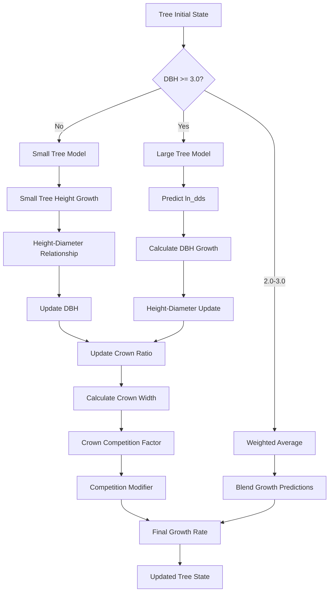

# FVS-Python: Southern Yellow Pine Growth Simulator

## Overview
FVS-Python is a Python implementation of the Southern variant of the Forest Vegetation Simulator (FVS). It simulates the growth and yield of four southern yellow pine species:
- Loblolly Pine (Pinus taeda, LP)
- Shortleaf Pine (Pinus echinata, SP)
- Longleaf Pine (Pinus palustris, LL)
- Slash Pine (Pinus elliottii, SA)

The simulator generates yield tables for planted stands from age 0 to 50 years, using average stand characteristics.


### Individual Tree Growth Model Interactions


## Development Guidelines

- Break down tasks into distreet steps
- Explain your approach and logic in detail
- Ask me for any needed clarifications

### First Principles

1. Version Control is a Must.
2. Keep it Simple, Stupid (KISS).
3. Separation of Concerns.
4. Separate Configuration from Code.
5. You Aren't Gonna Need It (YAGNI).
6. Premature Optimization is the Root of All Evil.
7. Don't Repeat Yourself (DRY).
8. Composability.
9. Test the Critical Bits.
10. Fail Fast and Loudly.


### Configuration
- Use Configuration Files.
- Use environment variables.
- Clearly document all parameters.


### End-to-End Pipeline
- Define the Minimal Pipeline: Identify the essential steps needed to process raw data to a final output and implement them.
- Iterative Development: Start with the most straightforward implementation and iteratively add features, optimizations, and complexity.
- Validate Early: Ensure that each stage of the pipeline works correctly before moving on to the next.
- Simple Tools First: Use simple, well-understood tools and methods initially, and only introduce more advanced techniques when necessary.
- Document the Process: Keep documentation up-to-date with each iteration to ensure the evolving pipeline remains understandable.

## Core Components

### Individual Tree Growth Models

The growth modeling system implements several key equations:

1. **Height-Diameter Relationships**
   - Curtis-Arney equation (primary method)
   - The SN variant will use the Curtis-Arney functional form as shown here:
   ```python
   height = 4.5 + p2 * exp(-p3 * DBH**p4)  # Curtis-Arney for DBH >= 3.0 inches
   height = (4.5 + p2 * exp(-p3 * 3**p4) - 4.51) * (DBH - Dbw) / (3 - Dbw)) + 4.51 # Curtis-Arney for DBH < 3.0 inches
   ```

2. **Bark Ratio Relationships**
   - Bark ratio estimates are used to convert between diameter outside bark and diameter inside
bark
   - bark_ratio is bounded between 0.8 and 0.99
   - diameter measured at breast height
   - The bark ratio is calculated using the following functional form:
   ```python
   diameter_inside_bark = bark_ratio_b1 + bark_ratio_b2 * diameter_outside_bark
   bark_ratio = diameter_inside_bark / diameter_outside_bark
   ```

3. **Crown Ratio Relationships**
   - Crown ratio equations are used to estimate initial crown ratios for regenerating trees established during a simulation.
   - Crown ratios for newly established trees during regeneration are estimated using the following equation below.
   - Crown ratio is bounded between 0.2 and 0.9
   - A random component is added to the equation to ensure that not all newly established trees are assigned exactly the same crown ratio.
   ```python
   crown_ratio = 0.89722 - 0.0000461 * crown_competition_factor + small_random_component
   crown_competition_factor = 0.001803 * crown_width**2
   ```

4. **Crown Width Relationships**
   - The SN variant calculates the maximum crown width for each individual tree. 
   - Crown width is used to calculate crown competition factor (CCF). (CCF) within the model. When available, forest-grown maximum crown width equations are used to compute PCC and open-grown maximum crown width equations are used to compute CCF.
   - Crown width for the yellow pine species is estimated using the following functional forms:
   ```python
   crown_width = a1 + (a2 * DBH) + (a3 * DBH**2) + (a4 * crown_ratio) + (a5 * hopkins_index) # for open-grown SA >= 5.0 inches
   crown_width = (a1 + (a2 * 5.0) + (a3 * 5.0**2) + (a4 * crown_ratio) + (a5 * hopkins_index)) * (DBH / 5.0) # for open-grown SA < 5.0 inches
   crown_width = a1 + (a2 * DBH * 2.54) + (a3 * (DBH * 2.54)**2) * 3.28084 # for open-grown LP, SP, LL >= 3.0 inches
   crown_width = (a1 + (a2 * 3.0 * 2.54) + (a3 * (3.0 * 2.54)**2) * 3.28084) * (DBH / 3.0) # for open-grown LP, SP, LL < 3.0 inches
   hopkins_index = (elevation - 887) / 100) * 1.0 + (latitude - 39.54) * 4.0 + (-82.52 - longitude) * 1.25
   ```

5. **Small Tree Growth**
   - The small-tree height growth model predicts periodic potential height growth from height growth curves using the Chapman-Richards nonlinear functional form. 
   - A linear function fills in the height growth curves from 0 at age 0 to the lower end of the height growth curve. 
   - Height growth is computed by subtracting the current predicted height from the predicted height 5 years in the future, as depicted in the following equation.
   ```python
   small_tree_height_growth = c1 * si**c2 * (1.0 - exp(c3 * age))**(c4 * (si**c5))
   age = 1.0/c3 * (log(1.0 - (height / c1 / si**c2)**(1.0 / c4 / si**c5))) # height is tree height in feet
   ```

6. **Small to Large Tree Transition**
   - Height growth estimates from the small-tree model are weighted with the height growth estimates from the large tree model over a range of diameters (Xmin and Xmax) in order to smooth the transition between the two models. 
   - For example, the closer a tree's DBH value is to the minimum diameter (Xmin), the more the growth estimate will be weighted towards the small-tree growth model. 
   - The closer a tree's DBH value is to the maximum diameter (Xmax), the more the growth estimate will be weighted towards the large-tree growth model. 
   - If a tree's DBH value falls outside of the range given by Xmin and Xmax, then the model will use only the small-tree or large-tree growth model in the growth estimate. 
   - Xmin and Xmax vary by species.
   - The weight applied to the growth estimate is given by the following equation:
   ```python
   weight = 0 # if dbh < Xmin
   weight = 1 # if dbh >= Xmax
   weight = (dbh - Xmin) / (Xmax - Xmin) # if Xmin <= dbh <= Xmax
   estimated_height_growth = ((1 - weight) * small_tree_height_growth) + (weight * large_tree_height_growth)
   ```

7. **Large Tree Growth**
   - Trees are considered large when the diameter at breast height (DBH) is greater than or equal to 3.0 inches.
   - The large-tree model is driven by diameter growth meaning diameter growth is estimated first, and then height growth is estimated from diameter growth and other variables.
   - Instead of predicting diameter increment directly, the naturallog of the periodic change in squared inside-bark diameter (ln(DDS)) is predicted
   - The Southern variant predicts 5-year diameter growth using equation:
   ```python
   ln_dds = b1 + b2*log(dbh) + b3*dbh^2 + b4*log(cr) + b5*relative_height + b6*si + b7*basal_area_per_acre + b8*plot_basal_area_for_large_trees + b9*slope + b10*cos(aspect)*slope + b11*sin(aspect)*slope + forest_type_factor + ecounit_factor + planting_factor
   ```

## Species-Specific Parameters

### Growth Coefficients
```python
species_data = {
    'LP': {  # Loblolly Pine
        'p2': 243.860648,
        'p3': 4.28460566,
        'p4': -0.47130185,
        'Dbw': 0.5,
        'bark_ratio_b1': -0.48140,
        'bark_ratio_b2': 0.91413,
        'a1': 0.7380,
        'a2': 0.2450,
        'a3': 0.000809,
        'c1': 1.1421,
        'c2': 1.0042,
        'c3': -0.0374,
        'c4': 0.7632,
        'c5': 0.0358,
        'b1': 0.222214,
        'b2': 1.163040,
        'b3': -0.000863,
        'b4': 0.028483,
        'b5': 0.006935,
        'b6': 0.005018,
        'forest_type_factor': 0.000000,
        'ecounit_factor': 0.000000,
        'planting_factor': 0.245669,
        'Xmin': 1,
        'Xmax': 3
    },
    'SP': {  # Shortleaf Pine
        'p2': 444.0921666,
        'p3': 4.11876312,
        'p4': -0.30617043,
        'Dbw': 0.5,
        'bark_ratio_b1': -0.44121,
        'bark_ratio_b2': 0.93045,
        'a1': 0.5830,
        'a2': 0.2450,
        'a3': 0.0009,
        'c1': 1.4232,
        'c2': 0.9989,
        'c3': -0.0285,
        'c4': 1.2156,
        'c5': 0.0088,
        'b1': -0.008942,
        'b2': 1.238170,
        'b3': -0.001170,
        'b4': 0.053076,
        'b5': 0.040334,
        'b6': 0.004723,
        'forest_type_factor': 0.000000,
        'ecounit_factor': -0.265699,
        'planting_factor': 0.000000,
        'Xmin': 1,
        'Xmax': 3
    },
    'LL': {  # Longleaf Pine
        'p2': 98.56082813,
        'p3': 3.89930709,
        'p4': -0.86730393,
        'Dbw': 0.5,
        'bark_ratio_b1': -0.45903,
        'bark_ratio_b2': 0.92746,
        'a1': 0.113,
        'a2': 0.259,
        'a3': 0.0000001,
        'c1': 1.1421,
        'c2': 0.9947,
        'c3': -0.0269,
        'c4': 1.1344,
        'c5': -0.0109,
        'b1': -1.331052,
        'b2': 1.098112,
        'b3': -0.001834,
        'b4': 0.184512,
        'b5': 0.388018,
        'b6': 0.008774,
        'forest_type_factor': 0.000000,
        'ecounit_factor': 0.000000,
        'planting_factor': 0.110751,
        'Xmin': 1,
        'Xmax': 3
    },
    'SA': {  # Slash Pine
        'p2': 1087.101439,
        'p3': 5.10450596,
        'p4': -0.24284896,
        'Dbw': 0.5,
        'bark_ratio_b1': -0.55073,
        'bark_ratio_b2': 0.91887,
        'a1': -6.9659,
        'a2': 2.1192,
        'a3': -0.0333,
        'a4': 0.0587,
        'a5': -0.0959,
        'c1': 1.1557,
        'c2': 1.0031,
        'c3': -0.0408,
        'c4': 0.9807,
        'c5': 0.0314,
        'b1': -1.641698,
        'b2': 1.461093,
        'b3': -0.002530,
        'b4': 0.265872,
        'b5': 0.069104,
        'b6': 0.006851,
        'forest_type_factor': 0.000000,
        'ecounit_factor': 0.000000,
        'planting_factor': 0.227572,
        'Xmin': 1,
        'Xmax': 3
    }
}
```

### Typical Stand Characteristics
| Species | Initial TPA |
|---------|-------------|
| Loblolly | 500-700 |
| Shortleaf | 400-600 |
| Longleaf | 300-500 |
| Slash | 450-650 |

## Stand Simulation Process

### 1. Stand Initialization
```python
def initialize_planted_stand(species, tpa, site_index):
    """Initialize a planted pine stand.
    
    Args:
        species: Species code ('LP', 'SP', 'LL', 'SA')
        tpa: Trees per acre at planting
        site_index: Site index (base age 25)
    """
    stand = Stand()
    
    # Set initial tree attributes
    dbh_mean = 0.5  # inches at age 0
    dbh_sd = 0.1    # standard deviation
    
    # Generate initial tree list with random variation
    for _ in range(tpa):
        dbh = random.gauss(dbh_mean, dbh_sd)
        height = 1.0  # feet at age 0
        stand.add_tree(Tree(
            species=species,
            dbh=max(0.1, dbh),
            height=height,
            expansion_factor=1.0
        ))
    
    stand.site_index = site_index
    return stand
```

### 2. Growth Simulation
```python
def simulate_stand_growth(stand, end_age=50, timestep=5):
    """Simulate stand growth from age 0 to end_age.
    
    Args:
        stand: Initialized Stand object
        end_age: Final simulation age
        timestep: Years between calculations
    
    Returns:
        List of stand conditions at each timestep
    """
    results = []
    
    for age in range(0, end_age + 1, timestep):
        # Calculate competition
        stand.update_competition()
        
        # Grow trees
        for tree in stand.trees:
            # Height growth
            potential_height = potential_height_growth(
                tree, stand.site_index, age)
            modifier = competition_modifier(tree, stand)
            tree.height += potential_height * modifier
            
            # Diameter growth
            tree.dbh += calculate_diameter_growth(tree, stand)
        
        # Apply mortality
        stand.apply_mortality()
        
        # Calculate stand metrics
        metrics = {
            'age': age,
            'tpa': len(stand.trees),
            'ba_per_acre': calculate_basal_area(stand.trees),
            'volume_per_acre': calculate_volume(stand),
            'qmd': calculate_quadratic_mean_diameter(stand.trees),
            'dominant_height': calculate_dominant_height(stand)
        }
        
        results.append(metrics)
    
    return results
```

### 3. Yield Table Generation
```python
def generate_yield_table(species, site_classes, tpa_range):
    """Generate yield tables for different site classes and planting densities.
    
    Args:
        species: Species code
        site_classes: List of site index values to simulate
        tpa_range: List of initial trees per acre values
    
    Returns:
        DataFrame with yield table results
    """
    results = []
    
    for site_index in site_classes:
        for initial_tpa in tpa_range:
            # Initialize stand
            stand = initialize_planted_stand(
                species=species,
                tpa=initial_tpa,
                site_index=site_index
            )
            
            # Run simulation
            growth_results = simulate_stand_growth(stand)
            
            # Add to results
            for period in growth_results:
                period.update({
                    'species': species,
                    'site_index': site_index,
                    'initial_tpa': initial_tpa
                })
                results.append(period)
    
    return pd.DataFrame(results)
```

# Loblolly Pine Stand Simulator

A simplified growth simulator for loblolly pine plantations, modeling stand development from planting to maturity (50 years).

## Growth Model Overview

```mermaid
graph TD
    %% Initial State
    Start[Stand Initialization] --> |500 trees/acre| Init[Initial Trees]
    Init --> |For each tree| TreeState[Tree State<br/>DBH, Height, Crown]
    
    %% Growth Decision
    TreeState --> SizeCheck{DBH >= 3.0?}
    
    %% Small Tree Path
    SizeCheck -->|No| SmallTree[Small Tree Model]
    SmallTree --> HeightGrowth[Height Growth<br/>Chapman-Richards]
    HeightGrowth --> HDSmall[Height-DBH<br/>Relationship]
    
    %% Large Tree Path
    SizeCheck -->|Yes| LargeTree[Large Tree Model]
    LargeTree --> DiameterGrowth[Diameter Growth<br/>ln(DDS)]
    DiameterGrowth --> HDLarge[Height-DBH<br/>Relationship]
    
    %% Transition Zone
    SizeCheck -->|2.0-3.0| Transition[Weighted Average<br/>of Both Models]
    
    %% Competition & Updates
    HDSmall & HDLarge & Transition --> Competition[Competition<br/>Factor]
    Competition --> Crown[Update Crown Ratio]
    Crown --> Mortality[Apply Mortality]
    
    %% Stand Metrics
    Mortality --> Metrics[Calculate Stand Metrics]
    Metrics --> NextYear[Advance to Next Year]
    NextYear -->|Repeat| TreeState
    
    %% Output
    Metrics --> Output[Yield Table<br/>TPA, Volume, Size]
    
    %% Styling
    classDef process fill:#e1f5fe,stroke:#01579b,stroke-width:2px;
    classDef decision fill:#fff3e0,stroke:#ff6f00,stroke-width:2px;
    classDef output fill:#e8f5e9,stroke:#2e7d32,stroke-width:2px;
    
    class Start,Init,TreeState,SmallTree,LargeTree,HeightGrowth,DiameterGrowth,HDSmall,HDLarge,Transition,Competition,Crown,Mortality,Metrics,NextYear process;
    class SizeCheck decision;
    class Output output;
```

## Key Components

1. **Stand Initialization**
   - 500 trees per acre
   - Initial DBH: 0.5 inches (with random variation)
   - Initial height: 1.0 feet

2. **Growth Models**
   - Small Tree: Height-driven using Chapman-Richards
   - Large Tree: Diameter-driven using ln(DDS)
   - Smooth transition between 2-3 inches DBH

3. **Competition & Mortality**
   - Competition based on stand density
   - Size-dependent mortality
   - Background mortality rate

4. **Output**
   - Yield table at 5-year intervals
   - Stand visualization plots
   - Growth trajectory validation

## Configuration

All growth parameters are defined in `config/loblolly_params.yaml`:
- Height-diameter relationships
- Crown and bark parameters
- Growth model coefficients
- Mortality parameters
- Stand initialization values

## Usage

```bash
python -m src.main
```

This will:
1. Initialize a planted stand
2. Simulate growth for 50 years
3. Generate yield table and plots
4. Display summary statistics
