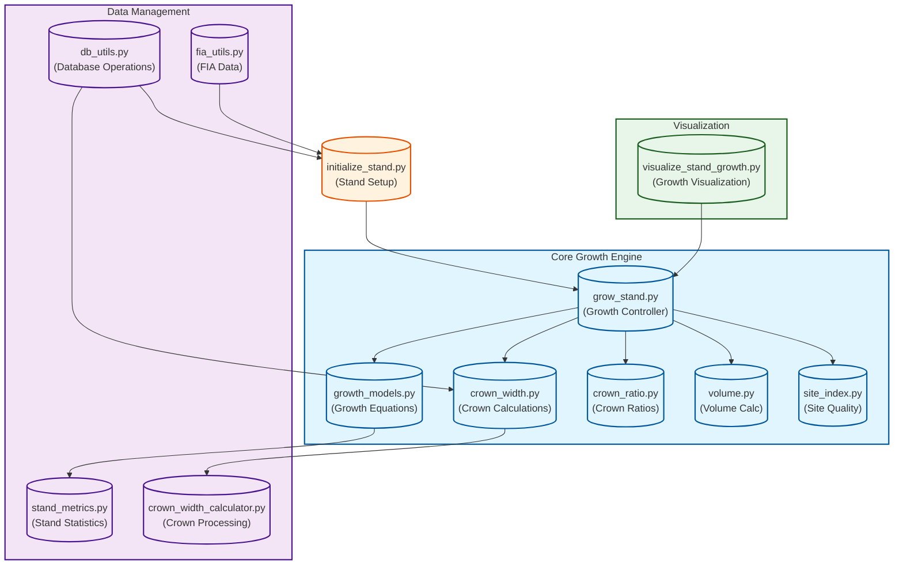

# FVS Python Codebase Structure

```mermaid
graph TD
    %% Styling
    classDef core fill:#e1f5fe,stroke:#01579b,stroke-width:2px
    classDef data fill:#f3e5f5,stroke:#4a148c,stroke-width:2px
    classDef viz fill:#e8f5e9,stroke:#1b5e20,stroke-width:2px
    classDef main fill:#fff3e0,stroke:#e65100,stroke-width:2px

    %% Main initialization
    init[("initialize_stand.py
(Stand Setup)")]:::main
    
    %% Core components
    grow[("grow_stand.py
(Growth Controller)")]:::core
    growth[("growth_models.py
(Growth Equations)")]:::core
    crown_w[("crown_width.py
(Crown Calculations)")]:::core
    crown_r[("crown_ratio.py
(Crown Ratios)")]:::core
    vol[("volume.py
(Volume Calc)")]:::core
    site[("site_index.py
(Site Quality)")]:::core
    
    %% Data management
    db[("db_utils.py
(Database Operations)")]:::data
    fia[("fia_utils.py
(FIA Data)")]:::data
    metrics[("stand_metrics.py
(Stand Statistics)")]:::data
    crown_calc[("crown_width_calculator.py
(Crown Processing)")]:::data
    
    %% Visualization
    viz[("visualize_stand_growth.py
(Growth Visualization)")]:::viz
    
    %% Relationships
    init --> grow
    grow --> growth
    grow --> crown_w
    grow --> crown_r
    grow --> vol
    grow --> site
    
    db --> init
    db --> crown_w
    fia --> init
    growth --> metrics
    crown_w --> crown_calc
    viz --> grow
    
    subgraph Core_Growth_Engine["Core Growth Engine"]
        growth
        grow
        crown_w
        crown_r
        vol
        site
    end
    
    subgraph Data_Management["Data Management"]
        db
        fia
        metrics
        crown_calc
    end
    
    subgraph Visualization["Visualization"]
        viz
    end
    
    %% Styling for subgraphs
    style Core_Growth_Engine fill:#e1f5fe,stroke:#01579b,stroke-width:2px
    style Data_Management fill:#f3e5f5,stroke:#4a148c,stroke-width:2px
    style Visualization fill:#e8f5e9,stroke:#1b5e20,stroke-width:2px
```
