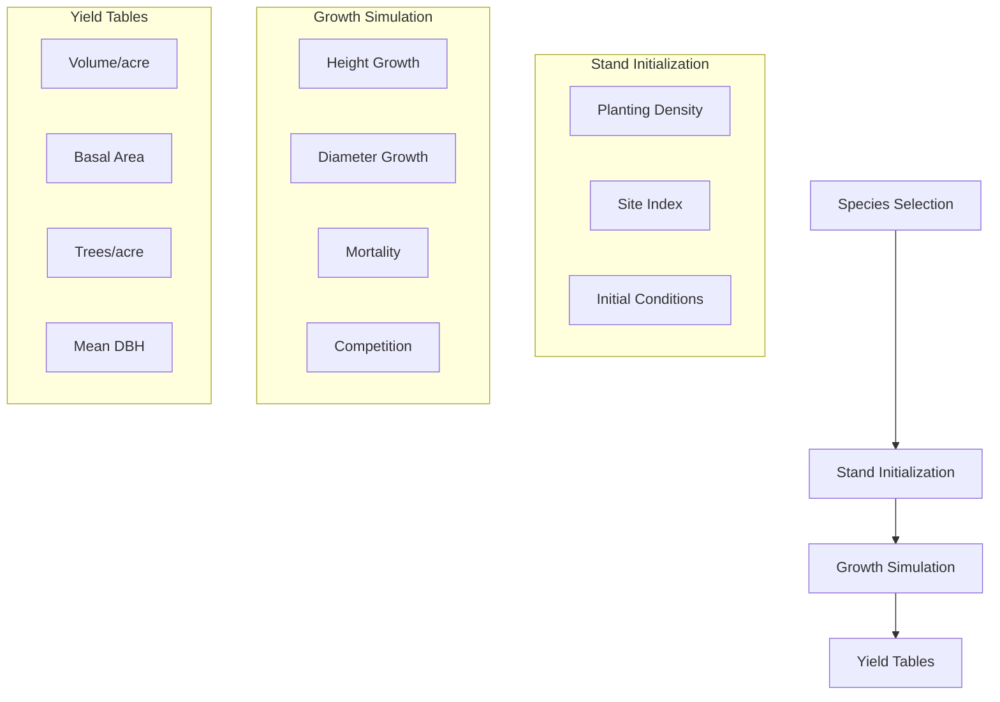
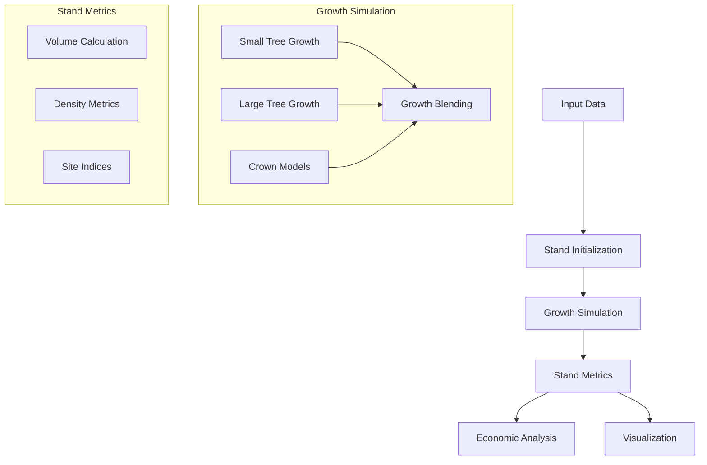
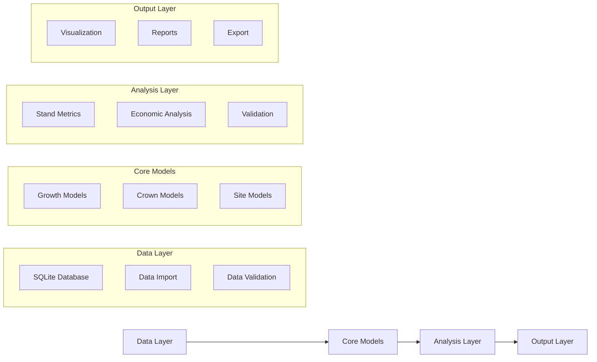
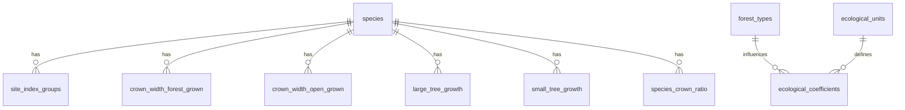

# FVS-Python: Southern Yellow Pine Growth Simulator

## Primary Objective
This project focuses on simulating the growth and yield of four southern yellow pine species:
- Loblolly Pine (Pinus taeda, LP)
- Shortleaf Pine (Pinus echinata, SP)
- Longleaf Pine (Pinus palustris, LL)
- Slash Pine (Pinus elliottii, SA)

The simulator generates yield tables for planted stands from age 0 to 50 years, using average stand characteristics.



## Table of Contents
1. [Overview](#overview)
2. [Project Goals](#project-goals)
3. [System Architecture](#system-architecture)
4. [Installation & Setup](#installation--setup)
5. [Core Components](#core-components)
6. [Database Schema](#database-schema)
7. [Implementation Details](#implementation-details)
8. [Usage Examples](#usage-examples)
9. [Development Guidelines](#development-guidelines)

## Overview

FVS-Python is a Python implementation of the Southern variant of the Forest Vegetation Simulator (FVS). It provides a modular and maintainable library for forest growth modeling and economic analysis.



## Project Goals

- Reimplement key growth and yield algorithms from the Southern FVS variant in Python
- Provide functions for economic analysis (NPV, IRR, LEV calculations)
- Create a well-documented and testable Python library
- Support future web API integration

## System Architecture

The project follows a modular architecture with clear separation of concerns:



## Core Components

### Growth Models (`growth_models.py`)

The growth modeling system implements several key equations:

1. **Height-Diameter Relationships**
   - Curtis-Arney equation (primary method)
   - Wykoff equation (alternative method)
   ```python
   height = 4.51 + b0 * exp(-b1 * dbh**b2)  # Curtis-Arney
   height = 4.51 + exp(b0 + b1 / (dbh + 1))  # Wykoff
   ```

2. **Small Tree Growth**
   - Uses Chapman-Richards function
   - Incorporates site index and age
   - Includes random variation and calibration
   ```python
   potht = c1 * si**c2 * (1.0 - exp(c3 * aget))**(c4 * (si**c5))
   ```

3. **Large Tree Growth**
   - Based on multiple stand and tree factors
   - Includes competition and site effects
   ```python
   ln_dds = b1 + b2*log(dbh) + b3*dbh^2 + b4*log(cr) + ...
   ```

### Crown Models (`crown_width.py`, `crown_ratio.py`)

Crown modeling includes:

1. **Crown Width Calculation**
   - Separate models for forest-grown and open-grown trees
   - Diameter-based equations with species-specific coefficients
   ```python
   forest_crown = a1 + a2*dbh + a3*dbh^2  # Basic form
   ```

2. **Crown Ratio Modeling**
   - Actual crown ratio (ACR) calculations
   - Competition and stand density effects
   ```python
   acr = f(height, competition, stand_density)
   ```

### Stand Management (`grow_stand.py`, `initialize_stand.py`)

Stand management functions handle:

1. **Stand Initialization**
   - Data validation and normalization
   - Initial stand metrics calculation
   - Species composition validation

2. **Growth Projection**
   - Time step management
   - Growth model application
   - Stand updating

## Database Schema

The SQLite database organizes forest modeling data into related tables:

### Core Tables
1. **species**: Primary species information
2. **site_index_groups**: Site index definitions and coefficients
3. **crown_width_forest_grown**: Forest-grown crown coefficients
4. **crown_width_open_grown**: Open-grown crown coefficients
5. **large_tree_growth**: Growth coefficients for large trees
6. **small_tree_growth**: Growth coefficients for small trees

### Supporting Tables
1. **forest_types**: Forest classification mappings
2. **ecological_units**: Ecological unit definitions
3. **ecological_coefficients**: Site-specific coefficients
4. **species_crown_ratio**: Crown modeling parameters

### Key Relationships


## Implementation Details

### Growth Model Implementation

1. **Diameter Growth**
   ```python
   def calculate_diameter_growth(tree, stand):
       if tree.dbh < 3.0:
           growth = small_tree_growth(tree, stand)
       elif tree.dbh > 5.0:
           growth = large_tree_growth(tree, stand)
       else:
           # Blend small and large tree growth
           weight = (tree.dbh - 3.0) / 2.0
           growth = blend_growth(weight, small_growth, large_growth)
       return apply_bounds(growth)
   ```

2. **Height Growth**
   ```python
   def calculate_height_growth(tree, stand):
       if tree.height < 4.5:
           return seedling_height_growth(tree, stand)
       
       potential = potential_height_growth(tree, stand)
       modifier = competition_modifier(tree, stand)
       return potential * modifier
   ```

3. **Crown Development**
   ```python
   def update_crown(tree, stand):
       # Update crown width
       tree.crown_width = calculate_crown_width(tree, stand)
       
       # Update crown ratio
       tree.crown_ratio = calculate_crown_ratio(tree, stand)
       
       # Calculate crown competition
       tree.crown_competition = crown_competition_factor(tree, stand)
   ```

### Stand Metrics Implementation

1. **Basal Area Calculation**
   ```python
   def calculate_basal_area(trees):
       return sum(0.005454154 * tree.dbh**2 for tree in trees)
   ```

2. **Stand Density Index**
   ```python
   def calculate_sdi(trees):
       return sum((tree.dbh/10)**1.605 for tree in trees)
   ```

3. **Volume Calculation**
   ```python
   def calculate_volume(tree):
       form_factor = species_form_factors[tree.species]
       return (tree.height * tree.basal_area * form_factor) / 12
   ```

## Usage Examples

### Basic Stand Growth Projection
```python
from fvs_core import Stand, Tree, GrowthSimulator

# Initialize stand
stand = Stand()
stand.add_tree(Tree(species="LP", dbh=10, height=60))
stand.add_tree(Tree(species="SP", dbh=12, height=65))

# Configure simulator
sim = GrowthSimulator(years=10, timestep=5)

# Run simulation
results = sim.run(stand)
```

### Economic Analysis
```python
from fvs_core import economics

# Calculate NPV
cash_flows = [
    (-1000, 0),   # Initial cost
    (500, 5),     # Thinning revenue
    (2000, 10)    # Final harvest
]
npv = economics.calculate_npv(cash_flows, rate=0.05)
```

## Development Guidelines

### Code Style
- Follow PEP 8 guidelines
- Use type hints for function parameters
- Document all functions using Google-style docstrings

### Testing
- Unit tests required for all new features
- Integration tests for major components
- Validation tests against FVS benchmarks

### Version Control
- Feature branches for new development
- Pull request reviews required
- Semantic versioning for releases

### Documentation
- Update documentation with code changes
- Include examples for new features
- Maintain changelog 

## Species-Specific Parameters

### Growth Coefficients
```python
species_data = {
    'LP': {  # Loblolly Pine
        'CurtisArney_b0': 243.860648,
        'CurtisArney_b1': 4.28460566,
        'CurtisArney_b2': -0.47130185,
        'Dbw': 0.5,
        'Wykoff_b0': 4.6897,
        'Wykoff_b1': -6.8801
    },
    'SP': {  # Shortleaf Pine
        'CurtisArney_b0': 444.0921666,
        'CurtisArney_b1': 4.11876312,
        'CurtisArney_b2': -0.30617043,
        'Dbw': 0.5,
        'Wykoff_b0': 4.6271,
        'Wykoff_b1': -6.4095
    },
    'LL': {  # Longleaf Pine
        'CurtisArney_b0': 98.56082813,
        'CurtisArney_b1': 3.89930709,
        'CurtisArney_b2': -0.86730393,
        'Dbw': 0.5,
        'Wykoff_b0': 4.5991,
        'Wykoff_b1': -5.9111
    },
    'SA': {  # Slash Pine
        'CurtisArney_b0': 1087.101439,
        'CurtisArney_b1': 5.10450596,
        'CurtisArney_b2': -0.24284896,
        'Dbw': 0.5,
        'Wykoff_b0': 4.6561,
        'Wykoff_b1': -6.2258
    }
}
```

### Typical Stand Characteristics
| Species | Initial TPA | Site Index (25yr) | Typical Rotation |
|---------|-------------|-------------------|------------------|
| Loblolly | 500-700 | 50-70 | 20-30 years |
| Shortleaf | 400-600 | 45-65 | 30-40 years |
| Longleaf | 300-500 | 45-65 | 35-45 years |
| Slash | 450-650 | 50-70 | 25-35 years |

## Stand Simulation Process

### 1. Stand Initialization
```python
def initialize_planted_stand(species, tpa, site_index):
    """Initialize a planted pine stand.
    
    Args:
        species: Species code ('LP', 'SP', 'LL', 'SA')
        tpa: Trees per acre at planting
        site_index: Site index (base age 25)
    """
    stand = Stand()
    
    # Set initial tree attributes
    dbh_mean = 0.5  # inches at age 0
    dbh_sd = 0.1    # standard deviation
    
    # Generate initial tree list with random variation
    for _ in range(tpa):
        dbh = random.gauss(dbh_mean, dbh_sd)
        height = 1.0  # feet at age 0
        stand.add_tree(Tree(
            species=species,
            dbh=max(0.1, dbh),
            height=height,
            expansion_factor=1.0
        ))
    
    stand.site_index = site_index
    return stand
```

### 2. Growth Simulation
```python
def simulate_stand_growth(stand, end_age=50, timestep=5):
    """Simulate stand growth from age 0 to end_age.
    
    Args:
        stand: Initialized Stand object
        end_age: Final simulation age
        timestep: Years between calculations
    
    Returns:
        List of stand conditions at each timestep
    """
    results = []
    
    for age in range(0, end_age + 1, timestep):
        # Calculate competition
        stand.update_competition()
        
        # Grow trees
        for tree in stand.trees:
            # Height growth
            potential_height = potential_height_growth(
                tree, stand.site_index, age)
            modifier = competition_modifier(tree, stand)
            tree.height += potential_height * modifier
            
            # Diameter growth
            tree.dbh += calculate_diameter_growth(tree, stand)
        
        # Apply mortality
        stand.apply_mortality()
        
        # Calculate stand metrics
        metrics = {
            'age': age,
            'tpa': len(stand.trees),
            'ba_per_acre': calculate_basal_area(stand.trees),
            'volume_per_acre': calculate_volume(stand),
            'qmd': calculate_quadratic_mean_diameter(stand.trees),
            'dominant_height': calculate_dominant_height(stand)
        }
        
        results.append(metrics)
    
    return results
```

### 3. Yield Table Generation
```python
def generate_yield_table(species, site_classes, tpa_range):
    """Generate yield tables for different site classes and planting densities.
    
    Args:
        species: Species code
        site_classes: List of site index values to simulate
        tpa_range: List of initial trees per acre values
    
    Returns:
        DataFrame with yield table results
    """
    results = []
    
    for site_index in site_classes:
        for initial_tpa in tpa_range:
            # Initialize stand
            stand = initialize_planted_stand(
                species=species,
                tpa=initial_tpa,
                site_index=site_index
            )
            
            # Run simulation
            growth_results = simulate_stand_growth(stand)
            
            # Add to results
            for period in growth_results:
                period.update({
                    'species': species,
                    'site_index': site_index,
                    'initial_tpa': initial_tpa
                })
                results.append(period)
    
    return pd.DataFrame(results)
```

## Usage Example: Generate Yield Tables

```python
from fvs_core import generate_yield_tables

# Define simulation parameters
species_list = ['LP', 'SP', 'LL', 'SA']
site_classes = [50, 60, 70]  # Site index values
tpa_range = [500, 600, 700]  # Initial planting densities

# Generate yield tables for all species
yield_tables = {}
for species in species_list:
    yield_tables[species] = generate_yield_table(
        species=species,
        site_classes=site_classes,
        tpa_range=tpa_range
    )

# Export results
for species, table in yield_tables.items():
    table.to_csv(f'{species}_yield_table.csv', index=False)
``` 