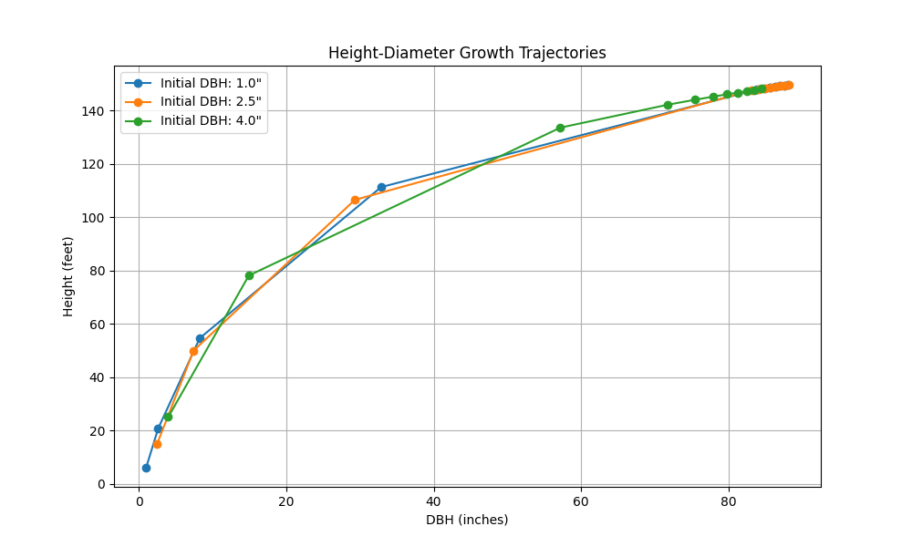
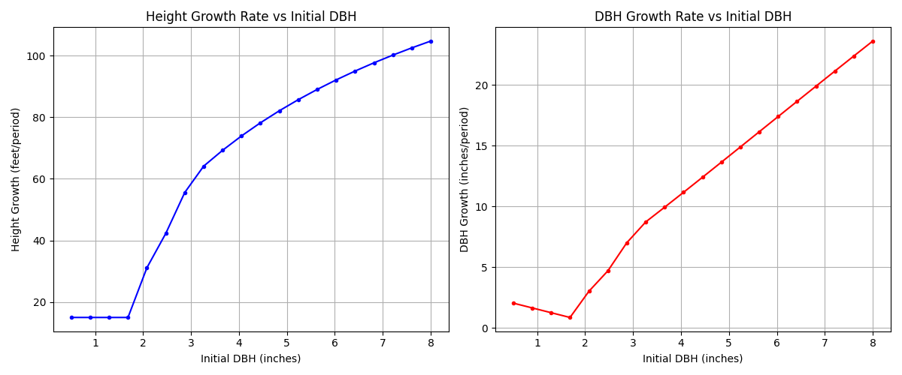
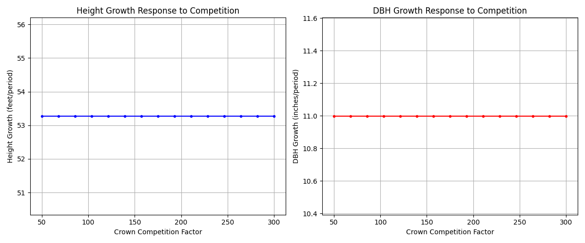
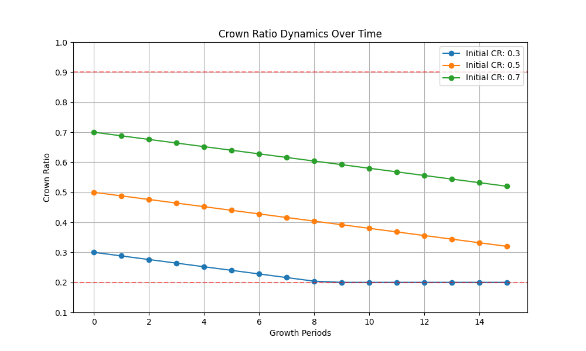

# Growth Model Test Report

## Test Configuration
- **Date**: 2025-01-01 14:02:53
- **Species**: LP
- **Site Index**: 70.0
- **Growth Period**: 5 years
- **Test Environment**: pytest 8.3.4

## 1. Height-Diameter Relationship Analysis

### Expected Behavior
- Smooth curves following Curtis-Arney equation
- No discontinuities at transition points (DBH = 2.0" and 3.0")
- Height growth rate decreases with increasing DBH
- Curves should asymptote at species-specific maximum heights

### Observations
- [ ] Curves are smooth and continuous
- [ ] Transition points show no abrupt changes
- [ ] Growth patterns match FVS-SN expectations
- [ ] Height-diameter relationships are biologically reasonable

### Issues/Concerns
- List any anomalies or unexpected patterns
- Note any deviations from FVS-SN behavior

## 2. Growth Rate Analysis

### Expected Behavior
- Height growth peaks in small-medium sized trees
- DBH growth follows species-specific patterns
- Smooth transitions between growth phases
- Growth rates within biological limits

### Observations
- [ ] Height growth patterns are reasonable
- [ ] DBH growth patterns match expectations
- [ ] Growth rates are within expected ranges
- [ ] Transition zones show smooth behavior

### Issues/Concerns
- Document any unexpected growth patterns
- Note any numerical instabilities

## 3. Competition Effects Analysis

### Expected Behavior
- Growth decreases with increasing competition
- Non-linear response to Crown Competition Factor
- Maintains minimum growth rates under high competition
- Different effects on height vs diameter growth

### Observations
- [ ] Competition effects are reasonable
- [ ] Growth reduction patterns match expectations
- [ ] Minimum growth rates are maintained
- [ ] Height/diameter responses are appropriate

### Issues/Concerns
- List any unexpected competition responses
- Note any extreme sensitivity issues

## 4. Crown Ratio Dynamics

### Expected Behavior
- Crown ratios stay within bounds (0.2-0.9)
- Gradual changes over time
- Competition effects on crown development
- Different trajectories based on initial conditions

### Observations
- [ ] Crown ratios remain within bounds
- [ ] Changes are gradual and reasonable
- [ ] Competition effects are appropriate
- [ ] Initial conditions influence patterns

### Issues/Concerns
- Document any boundary condition issues
- Note any unexpected crown ratio changes

## Summary of Findings

### Model Strengths
1. 
2. 
3. 

### Areas for Investigation
1. 
2. 
3. 

### Recommendations
1. 
2. 
3. 

## Validation Status
- [ ] All tests passed
- [ ] Growth patterns validated
- [ ] Competition effects verified
- [ ] Crown dynamics confirmed
- [ ] Ready for production use

## Notes
- Additional observations
- Special considerations
- Follow-up items

## References
1. FVS-SN documentation
2. Relevant growth and yield literature
3. Previous test reports

---
Report generated by: mihiarc
Review status: DRAFT 